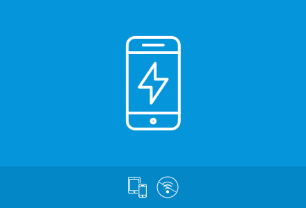
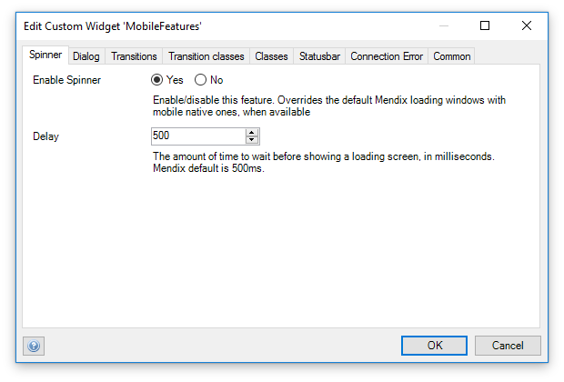
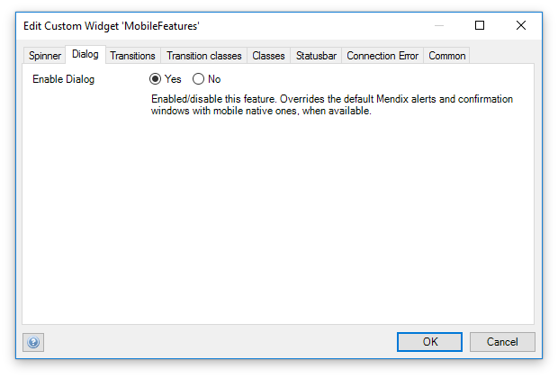
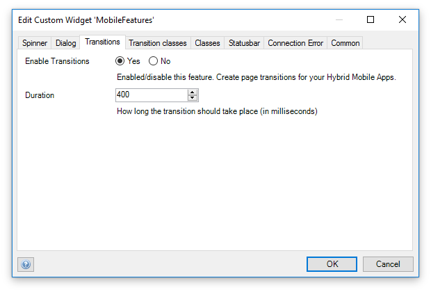
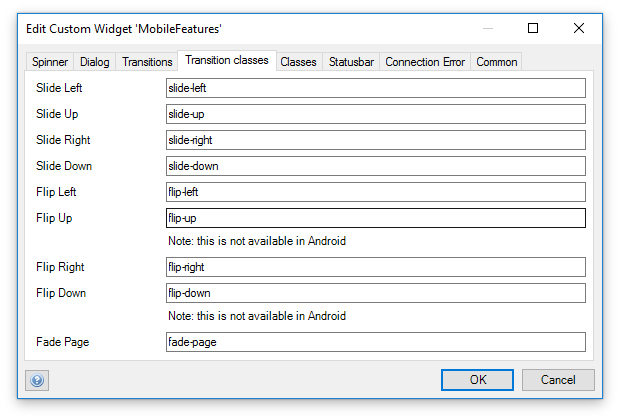
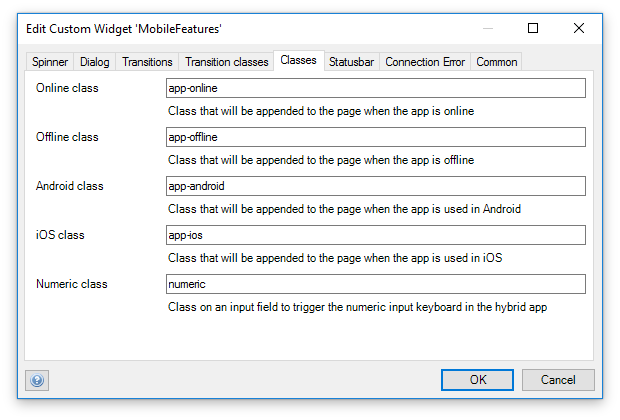
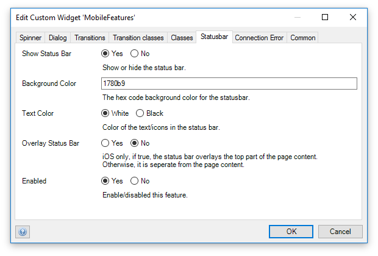

# Mobile Features Widget



Mobile Features widget can be placed in a page layout and used in mobile hybrid applications. This widget is heavily based on [MobileNativeFeatures](https://github.com/tieniber/MobileNativeFeatures) from [Eric Tieniber](https://github.com/tieniber). The difference with this widget is that it packs multiple features in one single widget.

## Features

This widget includes the following features that can be used in a Mendix mobile hybrid application
- Transitions: transition between pages using transitions
- Numeric input: Set an input field to numeric, triggers numeric keyboard on mobile devices
- Dialog: info, warning, and error messages will be shown using native dialog boxes
- Spinner: instead of the Mendix default loading dots, use the native loading spinners for your device
- Statusbar: set the text color and background of the status bar (i.e, the bar with time and other settings)
- ~~Custom Connection Error: Show a bar on top of the window when a connection error occurs (instead of a normal warning dialog)~~ (Work in progress)
- Custom body classes:
    - online/offline: When the app goes offline, it will add a configurable class to the body of the page
    - android/ios: Depending on the platform, it will add a configurable class to the body of the page (used for styling per platform)

Tested on Mendix version: `7.0.2`, should work in Mendix 6 as well

## Typical usage scenario

The widget is designed to be dropped on your master mobile page template. It overrides functions in the Mendix UI code to hook into Cordova plugins. The features above (with the exception of body classes) can be switched on/off.

## Dependencies

Be sure that these Cordova plugins are included in your PhoneGap config.xml file. Without these, some features will not work:

### Transitions
```xml
    <gap:plugin name="com.telerik.plugins.nativepagetransitions" source="npm" />
    <!-- This needs to be added to make sure the cordova-plugin-crosswalk-webview animates correctly -->
    <preference name="CrosswalkAnimatable" value="true" />
```

### Dialog
```xml
    <gap:plugin name="cordova-plugin-dialogs" source="npm" version="1.2.1" />
```

### Spinner
```xml
    <gap:plugin name="cordova-plugin-spinner" source="npm" />
```

### Statusbar
```xml
    <gap:plugin name="cordova-plugin-statusbar" source="npm" version="2.1.3" />
```

### Configuration

#### Spinner

This feature will override the normal Mendix spinner (loading dots) with a native mobile one.



#### Dialog

This feature will override the normal Mendix dialog with a native mobile one.



#### Transitions



#### Transition classes



#### Classes



#### Statusbar



### Connection Error

This feature is planned for a next version

### Advanced

**Note: These are all experimental options and might break in future Mendix versions. Please switch them off if it causes any problems (and create an issue here)**

- List view lazy load

When this feature is turned on the list view will render the items after the page is loaded which can greatly increase the user experience.

- Group box lazy load

When this feature is turned on the group box will render the items after the page is loaded which can greatly increase the user experience. You can add the `lazy` class to the groupbox to remove the spacing and borders.
